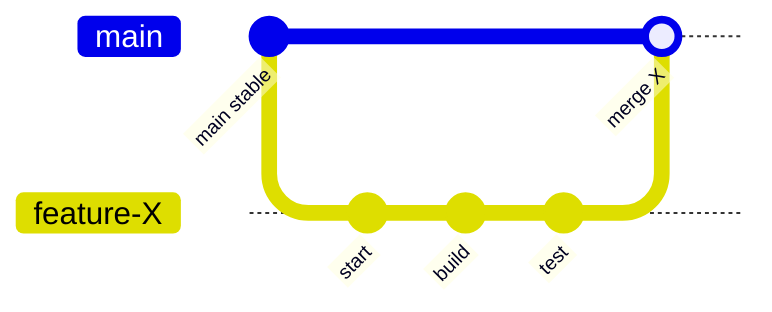
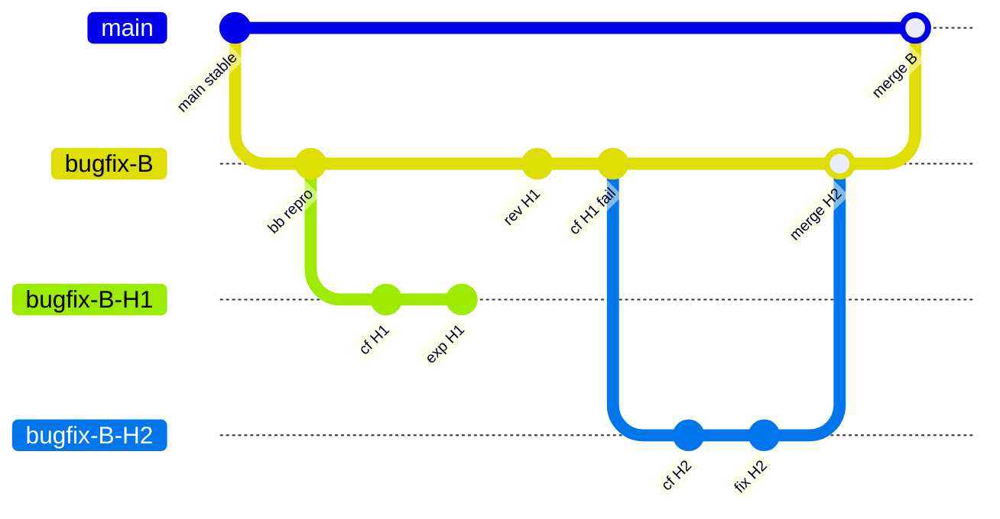
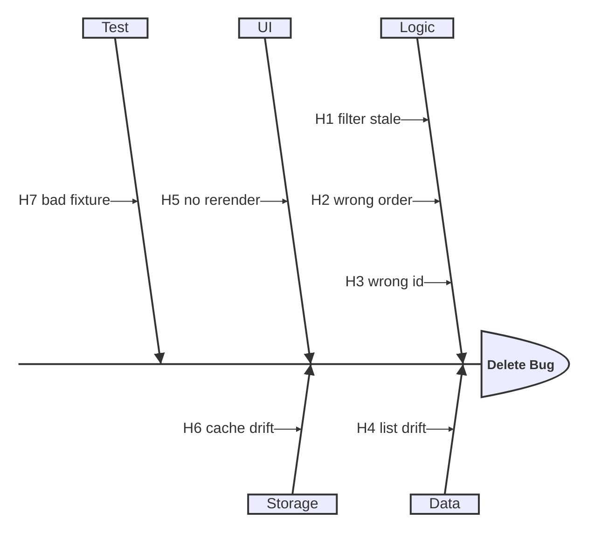

# Bugfix Hypothesis Branches

## Purpose

Use this skill to debug a bug or regression by treating each candidate explanation as a falsifiable hypothesis.

Keep four things synchronized:

1. `memory/blackboard.md`
2. `memory/counterfactual-note.md`
3. git branch state
4. the next ranked hypothesis

This skill is for coding agents with limited context windows. Keep notes compact, branch names stable, and patches small.

## When to use

Use this skill when:

- a bug has multiple plausible causes
- several subsystems may contribute
- failed patches contain useful learning
- you want a visible audit trail of diagnosis, rollback, and progress

Avoid this skill when:

- the fix is already obvious
- the task is pure refactoring
- there is no repro, failing test, or observable failure condition

## Mandatory operating rules

1. **Use git as part of the workflow, not as an optional tool.**
   - Before changing code, check branch state.
   - Create or switch to the task branch before patching.
   - Reflect meaningful progress in commits.

2. **Keep all working memory inside the project.**
   - All working memory files must live under `<project-root>/memory/`.
   - Never create or update memory outside the current workspace.
   - If `memory/` does not exist, create it at the project root.

3. **Use planning files before coding.**
   - Read `memory/blackboard.md` first.
   - Read `memory/counterfactual-note.md` second if it exists.
   - Use those files to choose the next move before editing code.

4. **Do not skip the blackboard.**
   - The blackboard is the source of truth for:
     - bug title
     - repro
     - ranked hypotheses
     - branch state
     - next move

5. **Do not patch first and explain later.**
   - Update or confirm planning state before code changes.

6. **Delete merged branches once their learning has been preserved.**
   - After merging a winning hypothesis branch into the task branch, delete the merged hypothesis branch when it is no longer needed.
   - After merging the task branch into `main`, delete the merged task branch when it is no longer needed.
   - Do not delete the current checked out branch, unmerged branches, or branches still needed for active investigation.

## Path discipline

Assume all paths are relative to the repository root.

Allowed memory paths:

- `memory/blackboard.md`
- `memory/counterfactual-note.md`
- `memory/api-breaking-changes.md`

Forbidden:

- `~/memory/...`
- `/tmp/...`
- parent directories outside the workspace
- hidden scratch files outside the repository

## Required execution order

Before any code change:

1. identify the repository root
2. ensure `memory/` exists inside the repository
3. read `memory/blackboard.md`
4. read `memory/counterfactual-note.md` if present
5. run `git status`
6. run `git branch --show-current`
7. create or switch to the task branch if needed
8. update the blackboard with the current hypothesis and next step
9. only then edit code

Do not skip any step above.

## Planning contract

Before patching, extract from `memory/blackboard.md`:

- current bug title
- current repro
- current ranked hypothesis
- current branch
- last failed attempt
- next planned action

If any of these are missing or stale, update the blackboard first.

## File roles

| File | Role | Read before coding |
|---|---|---|
| `memory/blackboard.md` | source of truth for issue state and next move | yes |
| `memory/counterfactual-note.md` | durable lessons from failed attempts | yes, if present |
| `memory/api-breaking-changes.md` | interface misunderstandings and breaking changes | when relevant |

## Git-first checklist

Before patching:

- `git status`
- `git branch --show-current`
- create or switch to the task branch
- confirm the next hypothesis in `memory/blackboard.md`

After each attempt:

- update blackboard
- update counterfactual note if needed
- commit notes and patch with a clear prefix

After each successful merge:

- switch to a safe branch
- delete merged branches that are no longer needed
- reflect branch cleanup in `memory/blackboard.md`

## Commit prefixes

Use short prefixes:

- `bb:` blackboard update
- `cf:` counterfactual note
- `exp:` experimental patch
- `rev:` revert failed patch
- `fix:` successful patch
- `merge:` winning merge

## Assets

The files under `assets/` are templates. Copy them into the project-local `memory/` directory before using the workflow.

- `assets/blackboard.md` -> `memory/blackboard.md`
- `assets/counterfactual-note.md` -> `memory/counterfactual-note.md`
- `assets/api-breaking-changes.md` -> `memory/api-breaking-changes.md`
- `assets/sample-ishikawa.md` -> reference only

Do not edit templates in `assets/` directly.

## Standard feature branch workflow

Use this for ordinary feature work.

## Hypothesis branch workflow

Use this for debugging and regressions.

## Minimal Ishikawa template

Keep labels short. Prefer one line per hypothesis.

## Workflow

1. update or create `memory/blackboard.md`
2. capture the repro and failure condition
3. build a compact Ishikawa chart
4. rank the hypotheses
5. create or switch to the task branch
6. choose the next most testable hypothesis
7. create a hypothesis branch if needed
8. write a counterfactual setup note
9. apply the smallest meaningful patch
10. test
11. if failed, revert and record what was learned
12. if successful, merge the winning hypothesis branch
13. if the winning hypothesis branch has been merged and is no longer needed, delete it
14. update blackboard
15. merge task branch when validated
16. if the task branch has been merged and is no longer needed, delete it

## Blackboard discipline

Keep `memory/blackboard.md` short and current.

It should answer:

- what is broken
- how to reproduce it
- what the top hypotheses are
- what was already tried
- what failed and why
- what branch is active
- what the next move is

Recommended sections:

- Bug title
- Repro
- Failing evidence
- Ishikawa chart
- Ranked hypotheses
- Branch state
- Next move

## Counterfactual-note discipline

Each entry should include:

- hypothesis id
- branch
- expected effect
- actual effect
- failing tests or logs
- lesson
- avoid-repeating guidance

Bad:

- `patch failed`

Good:

- `H2 failed: deletion updated tasks after filter derivation, so filtered view kept stale item reference`

## Recovery rule

If you started coding without:

- checking git state
- reading the blackboard
- using project-local `memory/`

stop and restore workflow discipline before continuing.

## Agent loop

Follow this loop exactly:

1. read blackboard
2. read counterfactual note if present
3. check git state
4. choose next hypothesis
5. update blackboard
6. create branch
7. patch minimally
8. test
9. on failure, revert and record
10. on success, merge winner
11. delete merged branches that are no longer needed
12. update blackboard again

## Output contract for the agent

When reporting progress, always include:

- current hypothesis
- current branch
- patch status
- decisive evidence
- next move

Example:

- `Current hypothesis: H2 wrong order`
- `Branch: bugfix-B-H2`
- `Status: failed`
- `Evidence: filtered list still points to stale derived state`
- `Next move: revert H2, record constraint, test H3 wrong id`

## Minimal success criteria

A run is complete when:

- the issue has a compact Ishikawa model
- the next move is recorded in `memory/blackboard.md`
- all working memory stayed inside `<project-root>/memory/`
- failed attempts preserved learning
- successful patch history is reflected in git
- merged branches that are no longer needed have been deleted
- the final winning fix is merged cleanly
