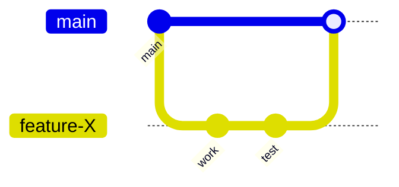
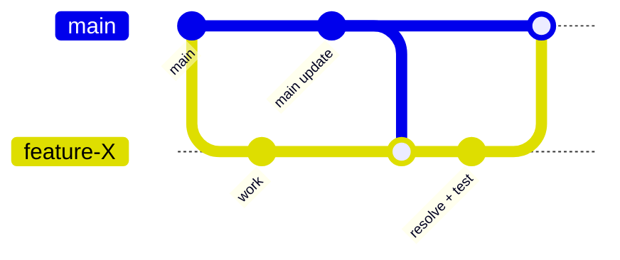

# Feature Branches

## Purpose
Implement changes in isolation using a short-lived feature branch, then merge cleanly to `main`.

## When to use
- any new feature or refactor
- small/medium changes with clear scope
- no need for multi-hypothesis debugging

## Mandatory rules
1. Use git before coding (never patch on `main`).
2. Keep branches short-lived.
3. Rebase/merge `main` before final merge.
4. Delete branches after merge when no longer needed.

## Required execution order

Before coding:
1. `git status`
2. `git checkout main`
3. `git pull`
4. `git checkout -b feature/<name>`

During work:
5. commit small increments
   - `git add -A`
   - `git commit -m "feat: <change>"`
6. run tests / checks

Before merge:
7. `git checkout main`
8. `git pull`
9. `git checkout feature/<name>`
10. `git merge main`  (or rebase if preferred)
11. resolve conflicts if any
12. re-run tests

Merge:
13. `git checkout main`
14. `git merge feature/<name>`

Cleanup:
15. `git branch -d feature/<name>`

## Git-first checklist

Before patch:
- `git status`
- `git branch --show-current`
- ensure not on `main`

Before merge:
- branch up to date with `main`
- tests passing

After merge:
- delete merged branch

## Commit prefixes
- `feat:` feature work
- `fix:` bug fix
- `refactor:` internal change
- `test:` tests
- `merge:` merge commit

## Standard flow

## Sync flow (with main changes)

## Minimal success criteria
- work isolated in feature branch
- branch synced with `main` before merge
- tests pass
- merged cleanly
- branch deleted
